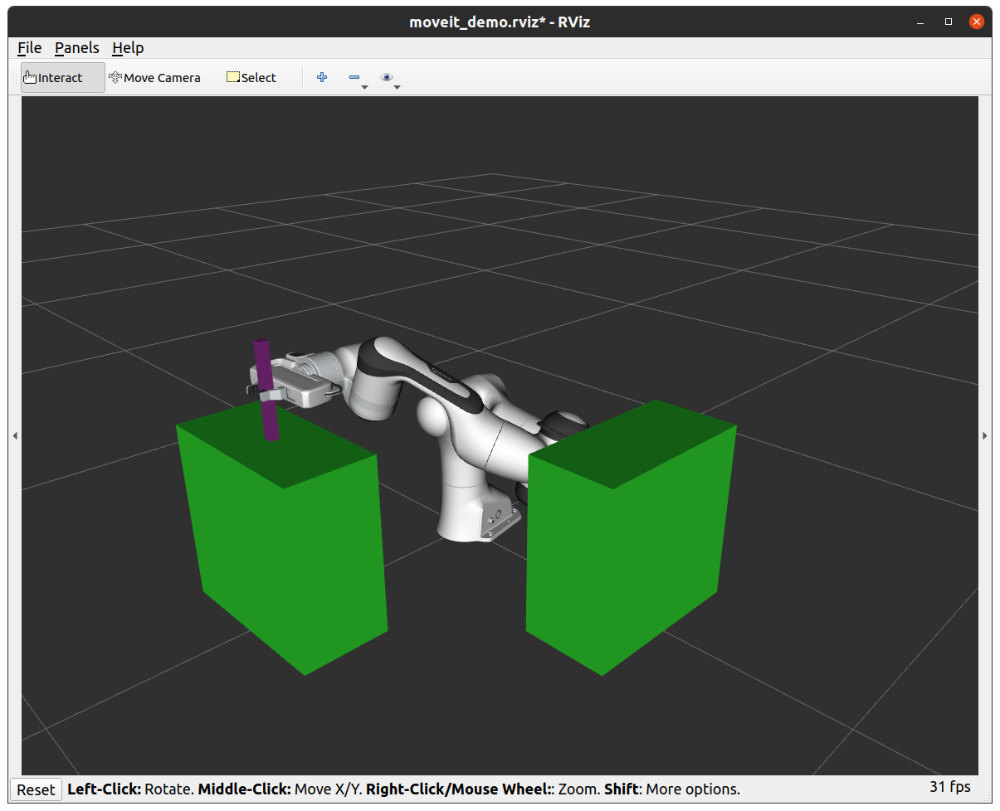
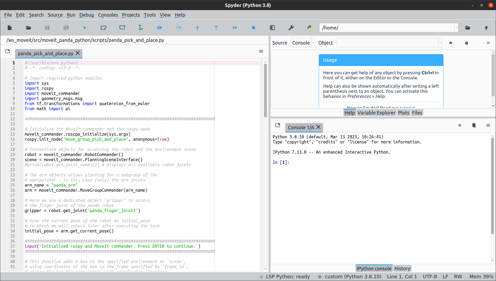

# moveit_panda_python
Python3 implementation of a pick and place task with Franka Emika's Panda robot


## Prerequisites
Follow the ["Getting started"](https://ros-planning.github.io/moveit_tutorials/doc/getting_started/getting_started.html) guide on the MoveIt Tutorials page. 

The "Getting started" tutorial will lead you through: 
- the installation of _ROS_ and Catkin in Ubuntu
- the creation of a _catkin workspace_ (~/ws_moveit/)
- the download and built of the latest _MoveIt_ source code incl. the _panda_moveit_config_ package

Following the MoveIt ["Quickstart in RViz tutorial"](https://ros-planning.github.io/moveit_tutorials/doc/quickstart_in_rviz/quickstart_in_rviz_tutorial.html) after completing above steps is a good indicator if things are set up properly.

## Pick and place task

### Download and build the package
Move into the source folder of the catkin package:
```
cd ~/ws_moveit/src/
```
Clone the package to your local folder:
```
git clone git@github.com:pythaios/moveit_panda_python.git
```
Build the downloaded package:
```
cd ~/ws_moveit/
source devel/setup.bash
catkin build
```
The build process should finish without any errors.

### Prepare the visualization
Open two terminals. Make sure to start 
```
roscore
```
in the first terminal and to run RViz and MoveIt in the second terminal:
```
cd ~/ws_moveit/
source devel/setup.bash
roslaunch panda_moveit_config demo.launch
```
In the RViz window, click on 'File -> Open Config' and select the config file `~/ws_moveit/src/moveit_panda_python/config/moveit_demo.rviz`

The RViz window including the Panda robot visualization should now look as follows:


### Run the simulation

In a third terminal, run
```
cd ~/ws_moveit/
source devel/setup.bash
roslaunch moveit_panda_python pick-and-place.launch
```
The terminal will prompt you to press ENTER to go through the script step by step. The script is divided into the following steps:
1. Initialize Rospy and the MoveIt commander
2. Add objects to the manipulation environment
3. Move the manipulator to its grasp position
4. Close the gripper / pick the object
5. Move the manipulator incl. the object to the goal pose
6. Open the gripper / place the object
7. Move the Panda robot back to its initial pose

After completing the script, the scene incldung robot and object should look as follows:


### Run the simulation (alternative)
Instead of using _roslaunch_ and the `pick-and-place.launch` file, you can alternatively run the script in a Python IDE, such as Spyder.

Note: Make sure that the Python path to 'rospy' and the other packages is properly set in the IDE. You can do this either by manually by adding the  modules to the Python path, in Spyder e.g. via 'Tools -> PYTHONPATH manager', or alternatively by sourcing the setup.bash script in a terminal and starting the IDE from there:

```
cd ~/ws_moveit/
source devel/setup.bash
spyder
```



## Test configuration
- Ubuntu 20.04.6 LTS
- Python 3.8.10
- ROS Noetic v1.16.0
- MoveIt 1 Noetic

## References & sources
- [MoveIt Motion Planning Framework](https://github.com/ros-planning/moveit)
- [MoveIt Tutorials - Move Group Python Interface](https://ros-planning.github.io/moveit_tutorials/doc/move_group_python_interface/move_group_python_interface_tutorial.html)
- [MoveIt Tutorials - Pick and Place (C++)](https://ros-planning.github.io/moveit_tutorials/doc/pick_place/pick_place_tutorial.html)
